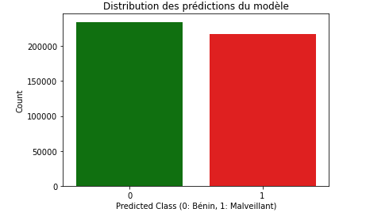
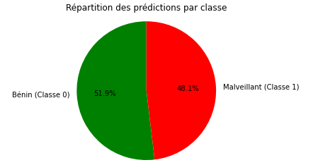
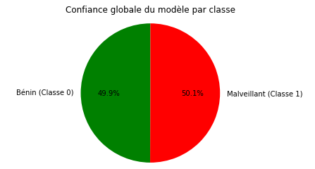
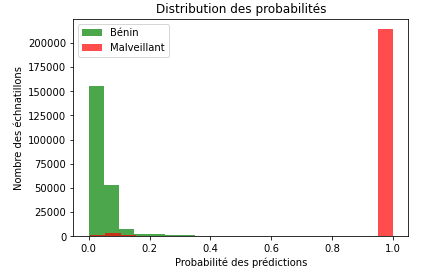
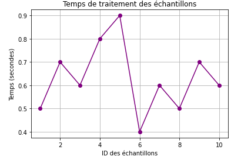

<h1>Système de détection des intrusions</h1>
La détection des intrusions réseau et l'utilisation d'un modèle de classification binaire pour distinguer le trafic malveillant du trafic bénin offrent des avantages cruciaux pour les entreprises en matière de cybersécurité. 
L'objectif de ce projet est de développer un système de classification binaire capable de détecter le trafic réseau malveillant ou bénin en analysant les données importantes telles que le protocole de communication, la durée, les ports de source et destination,etc.
<h2>Etape 1: extraction, chargement et transformation des données sur AWS </h2>
Tout d'abord, on commence par l'acquisition des données depuis plusieurs sources: logs, datasets:
<ul>
  <li>CICIDS 2018 </li>
  <li>KDD CUP 1999</li>
  <li>UNSW-NB 15</li>
  <li>D'autres datasets des données du traffic réseau + logs</li>
</ul>
Les données sont stockées au niveau du système de gestion des fichiers S3. 
Ensuite, on procède au traitement des données au niveau du datawarehouse Redshift afin de centraliser les données et créer le dataset final prêt à l'apprentissage.
<h2>Etape 2: Apprentissage des modèles de classification binaire et évaluation</h2>
Dans cette étape, on utilise le langage python pour entraîner les modèles de classification des attaques et ce en utilisant les packages: scikit-learn, pandas, numpy.
<h3>2-1-Préparation du jeu de données</h3>
<ul>
  <li>Suppression des doublons</li>
  <li>Traitement des valeurs nulles et NAN</li>
  <li>Choix des features importants pour l'apprentissage</li>
  <li>Etude des corrélations entre les variables</li>
  <li>Etude de la variance des variables</li>
  <li>Traitement des variables infinies</li>
  <li>Création des échantillons équilibrés des classes binaires: bénigne, maligne</li>
  <li>Encodage des variables catégorielles</li>
  <li>Normalisation du dataset</li>
</ul>
<h3>2-2-Entraînement des modèles de classification</h3>
Préparation des jeus de données: training, testing, validation. 
CHoix des hyperparamètres en utilisant la méthode du grid search. 
Entraînement des modèles de machine learning.  
<ul>
  <li>Random forest</li>
  <li>Logistic regression</li>
  <li>XGboost</li>
  <li>SVM</li>
  <li>Gradient boosting classifier</li>
  <li>MLP</li>
</ul>
<h3>2-3-Evaluation</h3>
<ul>
  <li>Accuracy (précision globale)</li>
  <li>Precision (taux de vrais positifs parmi les prédictions positives)</li>
  <li>Recall (taux de détection des positifs réels)</li>
  <li>F1-Score (harmonisation entre précision et rappel)</li>
  <li>Courbe ROC (évaluer le compromis entre le rappel et le taux de faux positifs)</li>
</ul>
<h3>2-4-Sauvegarde du meilleur modèle de prédiction et utilisation en temps réel</h3>
Pour ce projet, le modèle Xgboost offre la meilleure prédiction sur le jeu de données. 
Dans ce qui suit, nous allons évaluer les performances du modèle choisi sur le jeu de données de validation sous forme de modélisation graphique. 
Nous commençons par le calcul de la matrice de confusion qui va nous permettre de mesurer l'exactitude, précision et confiance du modèle à bien classifier le traffic et prédire la classe correspondante au traffic réseau.  
Pour clarifier les idées au niveau de ces mesures, nous introduisons certains termes ici :
<ul>
  <li>True Positive (TP) : ce sont les observations positives qui ont été prédites correctement par le modèle (ou pour simplifier, les observations prédites comme étant “oui” et étant véritablement “oui”).</li>
  <li>True Negative (TN) : de manière similaire, ce sont les observations négatives correctement prédites par le modèle (les observations prédites comme “non” et étant réellement “non”).</li>
<li>False Positive (FP) : ce sont les observations négatives prédites (de manière erronée) par le modèle comme étant positives (un vrai “non” prédit comme un “oui”).</li>
  <li>False Negative (TN) : ce sont les observations positives prédites comme étant négatives par le modèle (un vrai “oui” prédit comme un “non”).</li>
</ul>

L’accuracy, qui est la mesure de performance d’un modèle la plus intuitive, peut être définie à partir de ces termes : il s’agit tout simplement du ratio des observations correctes prédites sur le total des observations. 
Soit : accuracy = (TP+TN)/(TP+TN+FP+FN).  
C’est une métrique très efficace dans le cas de dataset équilibré.
Pour notre projet: l'accuracy est égale à 0.97

Le diagramme en barres représente la répartition des classes prédites par le modèle sur le jeu de données de validation, on remarque que les classes sont presque égales et qu'il arrive à bien classifier le traffic normal et le distinguer des attaques. 
 
De même, le diagramme en camembert représente plus précisément le pourcentage de prédiction de chaque classe, vu que l'apprentissage s'est effectué sur un dataset balancé, nous remarquons que les prédictions respectent 

<h3>Références</h3>

<ul>
  <li>http://kdd.ics.uci.edu/databases/kddcup99/kddcup99.html</li>
  <li>https://www.unb.ca/cic/datasets/ids-2017.html</li>
  <li>https://research.unsw.edu.au/projects/unsw-nb15-dataset</li>

</ul>
